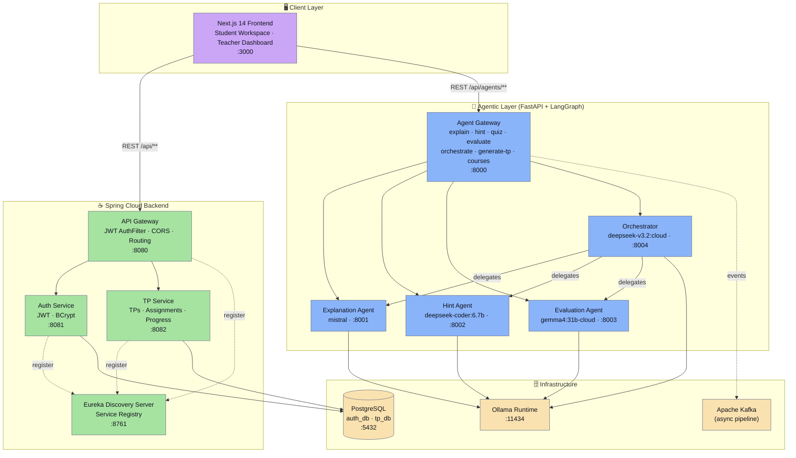
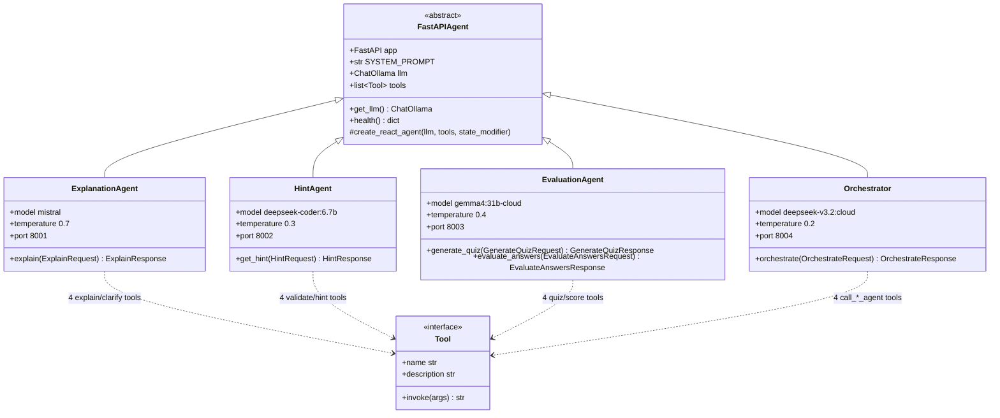
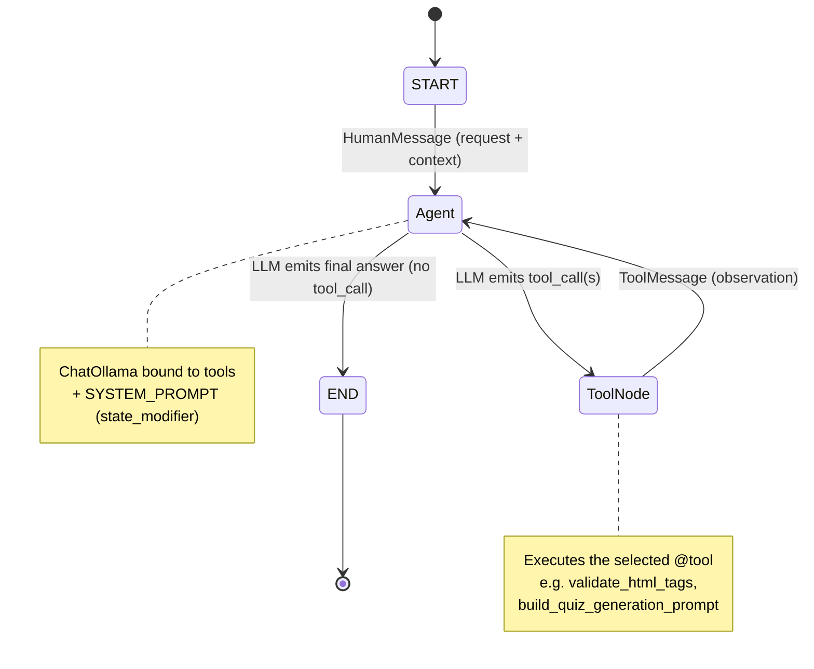
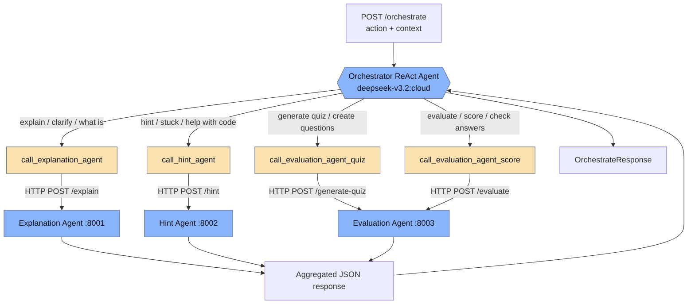
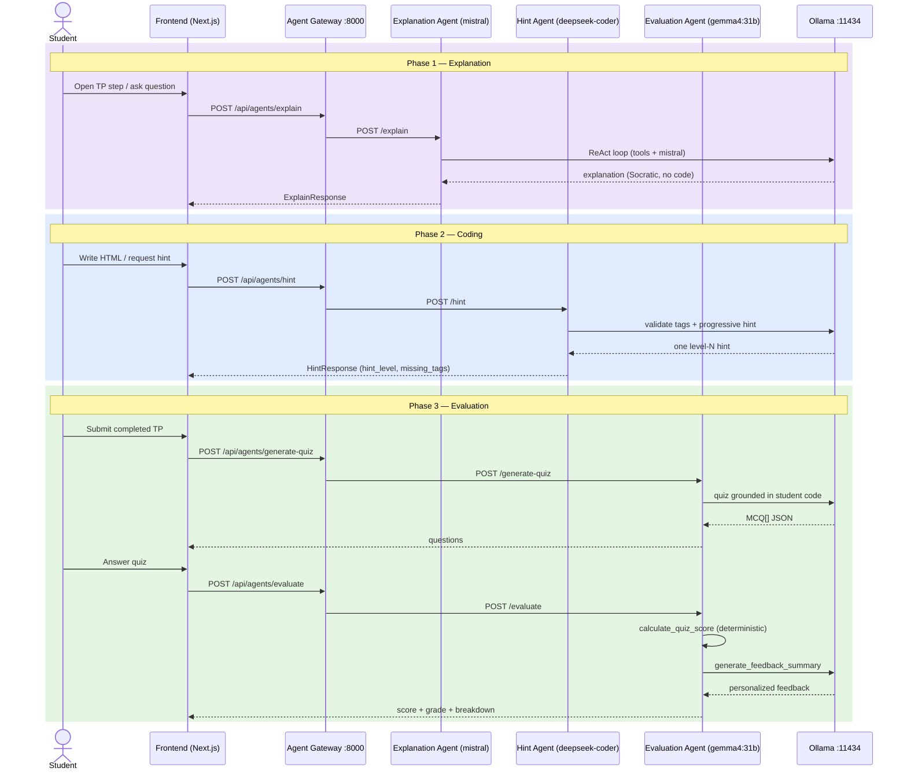

<div align="center">

## Project Report & Presentation

<a href="report-presentation/Agentic_TP_Presentation.pptx">
    
</a>

<a href="report-presentation/Rapport_Agentic_TP_Plateforme.pdf">
    
</a>


</div>

# Agentic TP Platform

> **AI-Powered Educational Platform for Programming Practicals**
> ENSET Challenge — Hackathon Submission · embedding3x

The **Agentic TP Platform** transforms how students complete practical programming assignments (*Travaux Pratiques*). It combines a Next.js workspace, a Spring Cloud microservices backend, and a suite of specialized AI agents — each powered by a different local LLM via Ollama — to deliver a fully guided, intelligent, and academically-honest coding environment.

🌐 **Live demo:** https://tp-front-seven.vercel.app/

---

## Highlight

| 🤖 3 Specialized AI Agents | 🦙 100% Local LLMs via Ollama | 🛡️ Anti-Cheat Built-in | 📊 Teacher Analytics |
| :---: | :---: | :---: | :---: |
| Each agent has its own model, system prompt, and tool set | mistral · deepseek-coder · gemma4 · deepseek-v3.2 | Copy-paste disabled, session timer, code validation | Per-student progress, hint usage, comprehension scores |

---

## System Architecture



---

## AI Agents

All agents use **LangGraph** (`create_react_agent`) with real tools. Each connects to a different local model via Ollama.

### 1. Explanation Agent — *Onboarding Phase*
- **Model:** `mistral` (local Ollama)
- **Port:** 8001 → `POST /explain`
- **Role:** Explains TP steps and answers clarification questions before coding begins. Uses Socratic method — never provides code. Tools: `explain_tp_step`, `get_learning_objectives`, `structure_clarification`, `detect_misconception`.

### 2. Hint Agent — *Coding Phase*
- **Model:** `deepseek-coder:6.7b` (local Ollama)
- **Port:** 8002 → `POST /hint`
- **Role:** Analyzes the student's live HTML code and delivers progressive hints (4 levels: abstract → conceptual → structural → specific). Validates required HTML tags, tracks hint history. Never writes complete code. Tools: `validate_html_tags`, `analyze_html_structure`, `generate_progressive_hint`, `assess_hint_level`.

### 3. Evaluation Agent — *Post-Session Assessment*
- **Model:** `gemma4:31b-cloud` (cloud via Ollama)
- **Port:** 8003 → `POST /generate-quiz` · `POST /evaluate`
- **Role:** Generates 3–5 comprehension MCQ questions grounded in the student's actual code submission. Evaluates answers and produces a score with personalized feedback. Tools: `build_quiz_generation_prompt`, `validate_quiz_structure`, `calculate_quiz_score`, `generate_feedback_summary`.

### 4. Orchestrator — *Multi-step Routing*
- **Model:** `deepseek-v3.2:cloud` (cloud via Ollama)
- **Port:** 8004 → `POST /orchestrate`
- **Role:** Handles complex requests that span multiple agents. Uses LangGraph to decide which agent(s) to invoke in sequence. Tools: `call_explanation_agent`, `call_hint_agent`, `call_evaluation_agent_quiz`, `call_evaluation_agent_score`.

---

## Agent Class Diagram (UML)

Every agent shares the same structural blueprint: a FastAPI app, a `ChatOllama` LLM, a LangGraph `create_react_agent`, a system prompt, and a typed tool set. They differ only in model, temperature, tools, and endpoints.



---

## LangGraph ReAct Loop (per agent)

Each specialized agent is built with `create_react_agent(llm, tools, state_modifier=SYSTEM_PROMPT)`. At runtime LangGraph runs the standard **reason → act → observe** loop: the LLM either calls a tool or emits the final answer, looping until no more tool calls are requested.



---

## Orchestrator Routing Graph (LangGraph)

The Orchestrator is itself a ReAct agent whose tools are *HTTP calls to the other agents*. The `deepseek-v3.2:cloud` model reads the request intent and delegates to the correct downstream agent, then returns its response.



---

## Request Flow — Three-Phase Student Session (Sequence)



---

## Technology Stack

| Layer | Technology | Details |
|-------|-----------|---------|
| **Frontend** | Next.js 14 + TypeScript + TailwindCSS | Catppuccin Mocha theme · anti-paste editor · live HTML preview |
| **Auth Service** | Spring Boot 3.3.4 + Spring Security | JWT (jjwt 0.12) · BCrypt · PostgreSQL · Eureka client |
| **TP Service** | Spring Boot 3.3.4 + JPA | TPs, Assignments, Progress with JSON column storage |
| **API Gateway** | Spring Cloud Gateway | JWT `AuthFilter` · CORS · route to all microservices |
| **Discovery** | Netflix Eureka Server | Service registry for Spring Cloud services |
| **Agent Framework** | LangGraph + LangChain Community | `create_react_agent` pattern with Ollama LLMs |
| **Agent Servers** | FastAPI + uvicorn | One service per agent · Python venv isolation |
| **LLM Provider** | Ollama (local + cloud relay) | mistral · deepseek-coder:6.7b · gemma4:31b · deepseek-v3.2 |
| **Database** | PostgreSQL 16 | `auth_db` + `tp_db` via Docker · JSON columns for nested TP data |
| **Message Bus** | Apache Kafka | Topics defined · async pipeline (optional) |
| **Containerization** | Docker Compose v2 | All 12 services · shared network · health checks |

---

## Repository Structure

```
.
├── .env                        # All credentials and model names (root)
├── start.sh                    # One-command local dev launcher
├── test.sh                     # Integration test suite
│
├── agents/
│   ├── explanation-agent/      # FastAPI + Mistral (LangGraph)
│   │   ├── main.py
│   │   └── tools/              # explain_tp.py · clarify_question.py
│   ├── hint-agent/             # FastAPI + deepseek-coder:6.7b (LangGraph)
│   │   ├── main.py
│   │   └── tools/              # html_validator.py · hint_generator.py
│   ├── evaluation-agent/       # FastAPI + gemma4:31b (LangGraph)
│   │   ├── main.py
│   │   └── tools/              # qcm_generator.py · evaluate_qcm.py
│   └── orchestrator/           # FastAPI + deepseek-v3.2 (LangGraph)
│       ├── main.py
│       └── orchestrator.py
│
├── backend/
│   ├── agent-gateway/          # FastAPI router — public AI endpoint
│   ├── auth-service/           # Spring Boot 3 — JWT auth, user CRUD
│   ├── tp-service/             # Spring Boot 3 — TP/Assignment/Progress
│   ├── api-gateway/            # Spring Cloud Gateway — routing + JWT filter
│   └── discovery-server/       # Eureka Server — service registry
│
├── frontend/
│   ├── app/                    # Next.js pages
│   │   ├── login/              # Auth (localStorage mock)
│   │   ├── student/            # dashboard · tp/[id] · result
│   │   └── teacher/            # dashboard · create-tp (+agent) · assign-tp
│   │       ├── courses/        #   course upload + RAG indexing UI
│   │       └── student-evaluation/  # per-student quiz score review
│   ├── components/
│   │   ├── agents/             # ExplanationChat.tsx · HintBox.tsx (real AI)
│   │   ├── quiz/               # QuizComponent.tsx (AI-generated quiz)
│   │   ├── IDELayout/          # Code editor + live preview + hint box
│   │   └── TPExplanation/      # Step explanation + ExplanationChat
│   ├── patterns/
│   │   └── InterpreterPattern/ # Tag-expression tree for HTML validation
│   └── services/
│       ├── agentService.ts     # Typed client for all agent endpoints (incl. generate-tp)
│       └── tpService.ts        # TP/Progress CRUD with localStorage
│
└── infra/
    ├── docker/
    │   ├── docker-compose.yml  # All 12 services (Compose v2, no version key)
    │   ├── docker-up.sh        # Wrapper script — resolves .env path
    │   └── init-multi-db.sh    # Creates auth_db + tp_db on first boot
    └── kafka/
        └── kafka-config.yml    # Topic definitions (6 topics)
```

---

## Getting Started

### Prerequisites

| Tool | Version | Required |
|------|---------|---------|
| Node.js | ≥ 18 | Yes — frontend |
| Python | ≥ 3.10 | Yes — agents |
| Ollama | latest | Yes — LLMs |
| Docker Desktop | latest | Yes — full stack |
| Java 17 + Maven | ≥ 17 | Optional — Spring Boot |

### Pull Ollama Models

```bash
ollama pull mistral
ollama pull deepseek-coder:6.7b
ollama pull gemma4:31b-cloud      # cloud relay — needs Ollama account
ollama pull deepseek-v3.2:cloud   # cloud relay — needs Ollama account
```

### Option A — One-command local dev (recommended)

```bash
git clone <repo-url>
cd enset-challenge-submission-embedding3x

# Start all agents + frontend dev server (no Docker needed)
./start.sh
```

`start.sh` automatically:
1. Checks Python, Node.js, Ollama prerequisites
2. Verifies required Ollama models are available
3. Creates a shared Python `.venv` and installs all agent packages
4. Installs frontend `node_modules` if needed
5. Frees any occupied ports (8000–8004, 3000)
6. Starts 5 Python services in background (one log file each in `logs/`)
7. Starts Spring Boot services if Java + Maven are available
8. Starts `next dev` for the frontend
9. Polls all `/health` endpoints until ready
10. Prints a live status dashboard

```bash
# After start.sh prints the status dashboard, run the test suite:
./test.sh --quick --agents-only    # instant health checks only
./test.sh --agents-only            # full LLM inference tests (2–5 min)
```

### Option B — Docker Compose (full stack)

```bash
cd infra/docker

# Start agents only (no Java build time):
./docker-up.sh agents

# Start everything (builds all images — takes ~5 min first time):
./docker-up.sh --build

# Stop everything:
./docker-up.sh down

# Tail logs:
./docker-up.sh logs explanation-agent

# Show status:
./docker-up.sh ps
```

> The wrapper script automatically passes `--env-file ../../.env` so all variables resolve correctly regardless of your working directory.

### Environment Variables (`.env`)

```bash
# All models are served via local Ollama
OLLAMA_BASE_URL=http://localhost:11434

EXPLANATION_AGENT_MODEL=mistral
HINT_AGENT_MODEL=deepseek-coder:6.7b
EVALUATION_AGENT_MODEL=gemma4:31b-cloud
ORCHESTRATOR_MODEL=deepseek-v3.2:cloud

JWT_SECRET=<your-32+-character-secret>

AUTH_DB_URL=jdbc:postgresql://localhost:5432/auth_db
TP_DB_URL=jdbc:postgresql://localhost:5432/tp_db
```

---

## Service Endpoints

| Service | URL | Key Endpoints |
|---------|-----|---------------|
| Frontend | http://localhost:3000 | `/` · `/login` · `/student/tp/[id]` · `/teacher/dashboard` |
| Agent Gateway | http://localhost:8000 | `/api/agents/explain` · `/hint` · `/generate-quiz` · `/evaluate` · `/orchestrate` · `/generate-tp` · `/courses` · `/courses/upload` · `/agents/health` |
| Explanation Agent | http://localhost:8001 | `POST /explain` · `GET /health` |
| Hint Agent | http://localhost:8002 | `POST /hint` · `GET /health` |
| Evaluation Agent | http://localhost:8003 | `POST /generate-quiz` · `POST /evaluate` |
| Orchestrator | http://localhost:8004 | `POST /orchestrate` · `GET /health` |
| Auth Service | http://localhost:8081 | `POST /api/auth/login` · `/register` · `GET /me` |
| TP Service | http://localhost:8082 | `GET/POST /api/tps` · `/assignments` · `/progress` |
| API Gateway | http://localhost:8080 | Routes all `/api/**` traffic |
| Eureka | http://localhost:8761 | Service registry dashboard |

---

## Student Workflow

```
Phase 1 — Explanation          Phase 2 — Coding              Phase 3 — Evaluation
──────────────────────         ─────────────────────         ───────────────────────
Explanation Agent               IDE with live preview         Evaluation Agent generates
explains the TP step            (sandboxed iframe)            3–5 MCQ questions from
using Mistral.                                                the student's own code
                                Hint Agent (deepseek-         using gemma4:31b.
Student asks follow-up          coder) provides
questions in the                progressive hints             Student answers quiz →
ExplanationChat UI.             (4 levels) when               AI scores + gives
                                student is stuck.             personalized feedback.
Copy-paste disabled.
Timer running.                  Required HTML tags            Score sent to teacher.
                                validated in real-time.
```

---

## Teacher Workflow

1. **Create TP** — title, description, difficulty, estimated time, starter HTML, step instructions, required HTML tags per step, static quiz questions
2. **Assign** — select students, set due date
3. **Monitor** — student progress dashboard (steps completed, time spent, hints used)
4. **Review** — per-student quiz score and AI-generated feedback

---

## Anti-Cheat Mechanisms

| Mechanism | Implementation |
|-----------|---------------|
| Copy-paste disabled | `onPaste` / `onDrop` / `onContextMenu` → `e.preventDefault()` |
| Drag-and-drop disabled | Same handler chain |
| Right-click disabled | Prevents browser context menu |
| Interpreter pattern validation | `TagExpression` + `AndExpression` checks required HTML tags |
| Session timer | Per-step countdown, auto-saved every 5 seconds |
| Hint tracking | Hint count persisted in progress record |

---

## Implementation Status

| Feature | Status |
|---------|--------|
| Frontend — student workspace (IDE, preview, timer) | ✅ Complete |
| Frontend — teacher dashboard (create, assign, monitor) | ✅ Complete |
| Frontend — agent UI (ExplanationChat, HintBox, QuizComponent) | ✅ Complete |
| Explanation Agent (Mistral + LangGraph) | ✅ Complete |
| Hint Agent (deepseek-coder:6.7b + LangGraph) | ✅ Complete |
| Evaluation Agent (gemma4:31b + LangGraph) | ✅ Complete |
| Orchestrator (deepseek-v3.2 + LangGraph) | ✅ Complete |
| Agent Gateway (FastAPI router) | ✅ Complete |
| Auth Service (JWT, BCrypt, Spring Security) | ✅ Complete |
| TP Service (CRUD, JSON column storage) | ✅ Complete |
| Spring Cloud Gateway (JWT filter, routing) | ✅ Complete |
| Eureka Discovery Server | ✅ Complete |
| Docker Compose (all 12 services) | ✅ Complete |
| One-command start script (`start.sh`) | ✅ Complete |
| Integration test suite (`test.sh`) | ✅ Complete |
| Anti-cheat mechanisms | ✅ Complete |
| Kafka topic configuration | ✅ Defined (async pipeline optional) |
| pgvector / RAG service | 🟡 Structure created — ingestion pipeline not wired |

---

## Current Limitations

- **HTML-only assignments** — backend language support (Python, Java) requires a sandboxed executor
- **No real-time teacher monitoring** — progress is pulled on page load, not pushed via WebSocket
- **RAG pipeline** — vector store directory structure exists but document ingestion is not wired
- **`gemma4:31b-cloud` availability** — requires an Ollama cloud account; quiz generation falls back to static questions if the model is not available
- **Auth frontend** — login page still uses localStorage mock; connecting to the real auth-service requires updating `authService.ts`

---

## Roadmap

**Short-term**
- Wire the RAG ingestion pipeline (Spring AI + pgvector) — directory structure is ready
- Connect frontend auth to the real Auth Service JWT flow
- WebSocket push for real-time teacher monitoring
- Rate limiting and response caching for LLM calls

**Medium-term**
- Multi-language support via Judge0 / Piston execution sandbox
- Kafka async agent communication (topics already defined)
- Code similarity plagiarism detection across cohorts
- Kubernetes manifests for production deployment

---

## Innovation

- **Model-per-agent** architecture — each agent runs a different LLM optimized for its task (coding hints → code model, explanations → instruction model, evaluation → reasoning model)
- **LangGraph tool calling** — agents use structured tools that shape their outputs, not just raw prompting
- **Graceful offline fallback** — all three frontend agent components (`ExplanationChat`, `HintBox`, `QuizComponent`) detect agent availability and fall back to deterministic local logic
- **Interpreter pattern validation** — formal tag-expression tree validates required HTML elements with composable `AndExpression`/`TagExpression` nodes
- **Code-aware evaluation** — quiz questions are generated from the student's *actual submitted code*, not generic TP content

---

## License

Hackathon submission — ENSET Challenge 2025.

---

> *Built with purpose. Grounded in knowledge. Guided by AI.*
> **Agentic TP Platform — embedding3x — ENSET Hackathon 2025**
